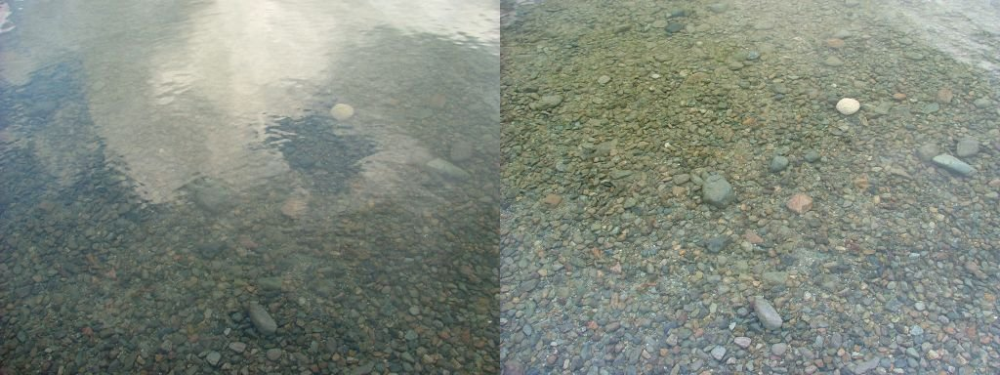

Put on a pair of polarized sunglasses, look at your phone, and slowly turn it.
On most phones, at one angle the screen goes dark.
The screen sends out polarized light: its electric field oscillates along a single direction.
The lenses absorb light polarized along one direction and let the perpendicular one through,
so when the screen's direction matches the one the lenses absorb, nothing gets through.
That direction is fixed once and for all when the lenses are made.

Now imagine a material that behaves like those lenses, except that the direction it
blocks depends on the colour of the light: one way for red, ninety degrees around for
blue. And imagine that this behaviour is a fingerprint of a kind of magnetism that is
otherwise remarkably hard to see.
That is, in short, the result of my new paper,
[*Emergent Gauge Fields and Linear Dichroism in Spin-Textured Altermagnets*](https://doi.org/10.1103/phr7-1zy5),
just published in *Physical Review Letters*.
This post explains what is behind it.

## Magnets that hide

Most of us meet magnetism through ferromagnets: the fridge magnet, the compass needle.
Inside, each magnetic atom behaves like a tiny bar magnet, which physicists call a
magnetic moment.
That magnetism comes from the electrons: each electron is itself a tiny magnet, and its
magnetic moment, called its spin, can point up or down.
In a ferromagnet the moments all point the same way, they add up, and a magnetic field
leaks out to pull on paper clips.

Antiferromagnets are the quieter sibling.
Neighbouring moments point in opposite directions and cancel exactly, so nothing leaks
out. They are far more common than ferromagnets, but they are hard to use: from the
outside, and even for the electrons moving inside them, the two opposite spin
directions look identical.

**Altermagnets**, a family identified only in the last few years, sit in between.
Their moments also alternate and cancel, so no magnetic field leaks out of them either.
But the two sets of atoms carrying the opposite moments are not simple copies of each
other: their surroundings are rotated relative to one another. Electrons notice.
In an altermagnet, whether an electron's spin points up or down depends on the
*direction it travels*.


*Top: the magnetic atoms. In the altermagnet the two kinds of atom sit in surroundings
(grey) rotated by 90 degrees. Bottom: the electrons. Each faint lavender sphere is an electron
moving out from the centre along its grey trail, and the arrow through it is its spin (grey
double arrows: both spins equally). In the altermagnet, electrons moving along one
diagonal carry spin up and those moving along the other carry spin down.*

This is the useful part of a ferromagnet, electrons with a preferred spin, without its
drawback: the leaking field, which makes magnetic bits interfere with each other when
packed tightly.
That is why altermagnets have become one of the most active topics in condensed-matter
physics, with experimental signatures reported in materials such as RuO₂, MnTe and
Mn₅Si₃, and in a family of layered vanadium compounds where the locking between spin and
direction of motion has been seen at room temperature.

There is a catch: with no field leaking out, an altermagnet does not announce itself.

## Real magnets twist

Real magnets are rarely perfectly uniform: in an actual crystal, the magnetic order
changes from place to place.
It can split into patches whose moments point in different directions, with thin boundaries
where the direction swings from one patch to the next.
It can form spirals, in which the direction of the moments rotates slowly as you move
through the material, like the steps of a spiral staircase.
And it can curl into more intricate patterns still, such as swirling vortices or tiny
knots called skyrmions.
Physicists call all these patterns magnetic textures.
In antiferromagnets they are the rule rather than the exception, precisely because there
is no leaking field to make them costly, and microscopes have already caught them in
candidate altermagnets.

An altermagnet, though, already has favourite directions of its own, set by its crystal:
the axes of its square lattice, and the diagonals along which electrons prefer one spin or
the other.
A twist brings in a direction of its own, the one along which the magnetic order turns.
So the question I asked was: *what does a slow magnetic twist do to the electrons of an
altermagnet, and which direction wins, the crystal's or the twist's?*

## Riding along with the twist

There is an elegant way to think about this.
Picture yourself as an electron moving through the twisted magnet, and suppose you
turn your head along with the magnetic moments as you go.
From your point of view, the magnet now looks perfectly uniform: every moment points
the same way it did where you started.

The price for this convenience is the one you pay on a merry-go-round.
Sit on it and the world around you looks still, but things start to behave strangely.
You feel pushed outwards, although nobody is pushing you, and a ball rolled straight
across the platform seems, from your seat, to curve away.
Physicists call these the centrifugal and the Coriolis forces.
They are not real pushes, just the price of watching the world from a turning seat, and
the sideways one depends on how fast and in which direction the ball is moving.
The electron's merry-go-round is set turning by its own motion: the faster it moves
along the twist, the faster its frame has to turn to keep up.
So, like the sideways push on the ball, the extra effect it feels depends on how fast and
in which direction it travels, and on how tightly the magnet is twisted.


*Two points of view of the same electrons. In the lab, the magnet twists and the
electrons' compasses keep still. A change of frame then turns every spin into line, the
compasses included. Riding along, the magnet looks uniform, but now the compasses turn as
the electrons move: steadily along the twist (green arc), not at all across it. That
turning is the extra field.*

Physicists call this an **emergent gauge field**.
*Emergent*, because no magnet or electric current produces it: it appears only because the
electron describes the world from its own turning point of view.
*Gauge field*, because it enters the electron's equations in the same way as the fields of
electricity and magnetism do.

The same trick works for any magnet. What makes altermagnets special is what this
extra field grabs onto.
In an ordinary antiferromagnet the two spin directions are interchangeable, so the field
cannot tell them apart: it still nudges the electrons, but it produces none of the
optical effect described below.
In an altermagnet, spin is tied to the direction of motion, and the emergent field
couples precisely to that connection.

## Light picks a side

How would you see any of this? With light.

Polarization is part of everyday life, even if we rarely notice it.
Photographers screw a polarizing filter onto their lenses: light reflected from water is
partly polarized, so turning the filter cuts the glare and lets the camera see through the
surface.
Polarized sunglasses do the same for your eyes.

Polarized light is also very good at revealing hidden directions inside a material.
Look at a clear plastic ruler against a computer screen through polarized sunglasses, and
bands of colour appear: the plastic was squeezed when it was moulded, and the stress frozen
into it makes it treat the two polarizations differently.

*Left: a polarizing filter (marked CPL) screwed onto a camera lens. Middle: the same water
without (left half) and with the filter (right half): the reflected clouds disappear and the
bottom shows through. Right: a plastic protractor between two polarizers, its colours
mapping the stress frozen into the plastic.
Photos via Wikimedia Commons:
[Jonathan Cutrer](https://commons.wikimedia.org/wiki/File:Panasonic_GX8_w_20mm_f_1.7_%26_Gobe_filters_-jcutrer_(44266982721).jpg),
[CC BY 2.0](https://creativecommons.org/licenses/by/2.0/);
[Amithshs](https://commons.wikimedia.org/wiki/File:Reflection_Polarizer2.jpg), public domain;
[Nevit Dilmen](https://commons.wikimedia.org/wiki/File:Plastic_Protractor_Polarized_05375.jpg),
[CC BY-SA 3.0](https://creativecommons.org/licenses/by-sa/3.0/).*

A magnetic twist does something similar to an altermagnet, with one difference: instead of
delaying one polarization, as the plastic does, it absorbs it.
The twist breaks the square symmetry of the crystal, and the result is
**linear dichroism**: the material absorbs light polarized along one direction much more
strongly than light polarized perpendicular to it, like the sunglasses.
In the calculation the effect is not subtle.
Over a broad range of frequencies, absorption is dominated almost entirely by a single
polarization.

Here is the important part.
For an ordinary antiferromagnet with exactly the same twist, this absorption is
forbidden by symmetry, unless one adds spin-orbit coupling, a subtle relativistic effect
that links an electron's spin to its motion and is usually invoked to explain such signals
in magnets.
The altermagnet does not need it.
Polarization-resolved absorption is therefore not just a way to see a magnetic twist:
it is a test of whether the material is an altermagnet at all.

## A ninety-degree flip

The direction the material prefers is where the story gets interesting.


*Computed with the model of the paper for a spiral at 22.5 degrees from a crystal axis.
Top: how one-sided the absorption is. Bottom: the direction of strongest absorption. At
low frequency it is pinned to a crystal axis; at the crossover it swings by 90 degrees
and then turns toward a direction set by the twist (green dashed line).*

At low frequencies, the absorption direction is **locked** to the crystal: it sits on
one of the crystal's own axes and stays there, whatever the twist is doing.
At a crossover frequency, the dichroism briefly collapses, the two polarizations are
absorbed almost equally, and the preferred direction swings round by ninety degrees.
Above it, in the **tracking** regime, the direction is set by the twist instead.
More precisely, it approaches the twist direction mirrored across the crystal's
diagonal.

Both regimes are useful.
The locked regime gives a strong, clean signal that a twist is present.
The tracking regime reads off which way it points.
And the crossover between them falls at a frequency set by the strength of the
altermagnetism and the pitch of the twist.
For the layered altermagnets studied in laboratories today, with textures of the size
already imaged, the whole locked-to-tracking sequence lies between the terahertz and
the mid-infrared, a range that polarization-resolved spectroscopy reaches routinely.

Put the two regimes side by side and you get the picture below: a slab of twisted
altermagnet with two beams shining through it, one at low and one at high frequency.
Each beam arrives carrying both polarizations.
One is absorbed (the fainter wave, dying inside the crystal) and only the other comes out.
The dials beside the exiting beams show the surviving polarization face on: from one beam
to the other it has swung round, from a crystal axis to a direction set by the twist.


*The same twisted altermagnet, two colours of light: at low frequency the polarization
that gets through is set by the crystal, at high frequency by the twist.*

## Why this matters

There are three reasons I find this exciting.

**A way to see hidden magnetism.**
Altermagnets give almost nothing away to the probes we use for ordinary magnets.
Polarized light offers a contact-free, table-top way to map their textures, and the
locked-to-tracking flip is a signature that is hard to fake.

**A fingerprint, not just a signal.**
Because the effect vanishes for an ordinary antiferromagnet with the same twist, it
discriminates between two kinds of magnet that are otherwise easy to confuse.
The conclusions also survive the weak spin-orbit coupling present in real materials,
which, if anything, adds information: it makes the handedness of the twist visible
too.

**Magnetism as a design knob.**
Turn the argument around. If the twist sets how a material absorbs light, and also how it
conducts electricity (the paper shows that direct currents feel it too), then writing a
twist into an altermagnet becomes a way to program its optical and electronic behaviour
along chosen directions.

This is a theoretical prediction, and the last word belongs to experiment.
The test it calls for is a clean one: shine polarized terahertz or infrared light on a
twisted altermagnet, rotate the polarization, and watch whether the direction it prefers
swings by ninety degrees as the frequency goes up.

---

**The paper:** A. Maiani, *Emergent Gauge Fields and Linear Dichroism in Spin-Textured
Altermagnets*, Phys. Rev. Lett. **137**, 136703 (2026),
[doi:10.1103/phr7-1zy5](https://doi.org/10.1103/phr7-1zy5).
A free preprint is on [arXiv:2602.14950](https://arxiv.org/abs/2602.14950).

**Code and data:** everything needed to reproduce the figures of the paper is openly
available on Zenodo,
[doi:10.5281/zenodo.18658428](https://doi.org/10.5281/zenodo.18658428).

*This work was funded by the Wallenberg Initiative on Networks and Quantum Information.*
